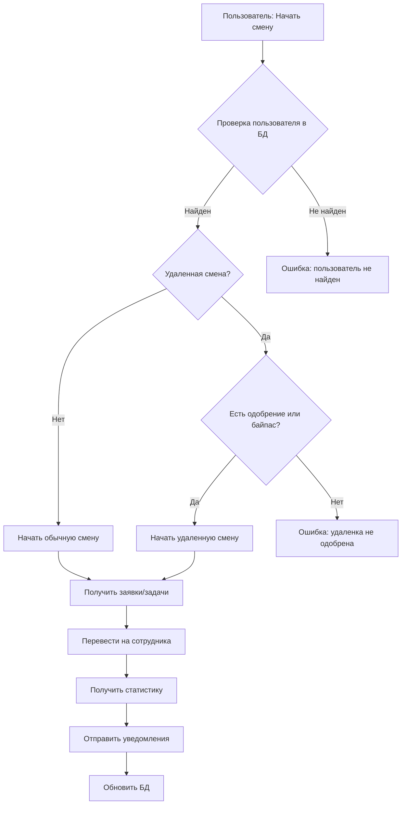
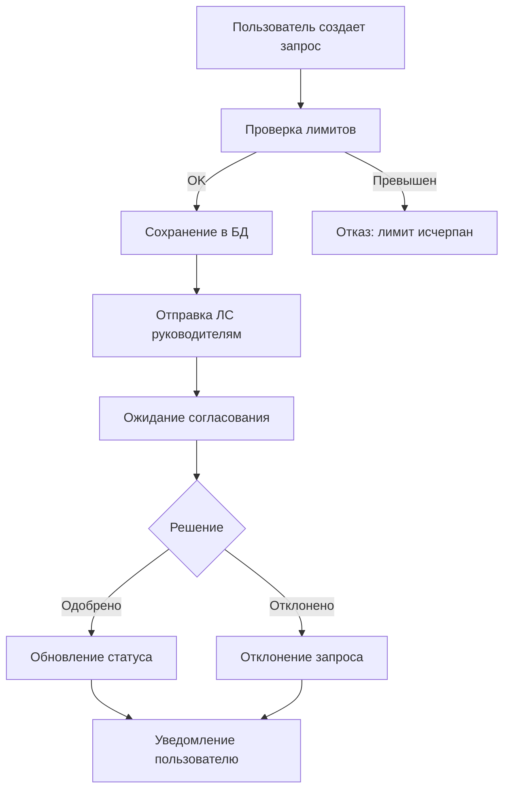
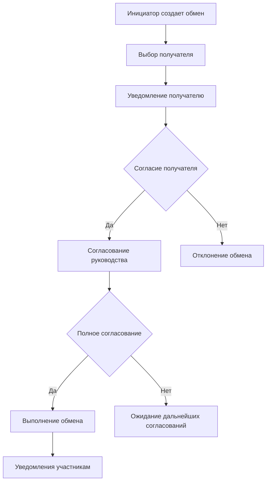

#  Полная архитектура Telegram бота SmenaControl

##  Оглавление
1. [Обзор системы](#обзор-системы)
2. [Структура проекта](#структура-проекта)
3. [Компоненты системы](#компоненты-системы)
4. [База данных](#база-данных)
5. [Обработчики команд](#обработчики-команд)
6. [Сервисы](#сервисы)
7. [Утилиты](#утилиты)
8. [Конфигурация](#конфигурация)
9. [Процессы и рабочие потоки](#процессы-и-рабочие-потоки)
10. [Таблица взаимодействий компонентов](#таблица-взаимодействий-к)

11. [API интеграции](#api-интеграции)
12. [Безопасность и права доступа](#безопасность-и-права-доступа)

##  API интеграции13. [Мониторинг и логирование](#мониторинг-и-логирование)

---

##  Обзор системы

SmenaControl - это Telegram бот для автоматизации управления рабочими сменами в технической поддержке. Система обеспечивает:

- **Управление сменами**: заступление на смену с автоматическим переводом заявок
- **Удаленная работа**: система запросов и согласований удаленных смен
- **Обмен сменами**: механизм обмена сменами между сотрудниками
- **Напоминания**: создание и отправка напоминаний
- **Статистика**: отчеты по работе техподдержки
- **Административные функции**: управление лимитами и правами

###  Основные принципы архитектуры:
- **Модульность**: разделение на логические компоненты
- **Масштабируемость**: возможность расширения функциональности
- **Надежность**: обработка ошибок и восстановление
- **Безопасность**: контроль доступа и защита данных

---

##  Структура проекта

```
SmenaControl/
 main.py                     # Точка входа приложения
 requirements.txt            # Зависимости Python
 bot.log                    # Основной лог файл
 shift_exchange_*.log       # Логи обмена смен
 
 src/                       # Основной код приложения
    __init__.py
    config.py             # Конфигурация системы
   
    database/             # Модули работы с БД
       __init__.py
       db_operations.py  # Основные операции с БД
       shift_exchange.py # Операции обмена смен
   
    handlers/             # Обработчики команд и сообщений
       __init__.py
       command_handlers.py      # Основные команды
       admin_handlers.py        # Административные команды
       reminder_handler.py      # Обработка напоминаний
       remote_work_handler.py   # Удаленная работа
       shift_exchange_handler.py # Обмен сменами
       shift_operations.py      # Операции со сменами
       stats_handlers.py        # Статистика (зарезервировано)
   
    services/             # Внешние сервисы и API
       __init__.py
       background_tasks.py      # Фоновые задачи
       reminder_service.py      # Сервис напоминаний
       servicedesk_api.py       # API ServiceDesk
       statistics.py           # Сбор статистики
       telegram_service.py     # Telegram API
   
    utils/                # Вспомогательные утилиты
        __init__.py
        helpers.py        # Общие функции
        keyboards.py      # Telegram клавиатуры
        logger.py         # Настройка логирования

 docs/                     # Документация
     ARCHITECTURE.md       # Базовая архитектура
     FULL_ARCHITECTURE.md  # Полная архитектура (этот файл)
     CIRCULAR_IMPORTS_FIX.md
     LAUNCH_MODULAR.md
     README_NEW.md
     REFACTORING_GUIDE.md
     create_admin_tables.sql
     database_migration_remote_work.sql
     old_version.py
     remote_work_instructions.md
```

---

##  Компоненты системы

### 1. **Основное приложение (`main.py`)**
```python
def main():
    """Основная функция запуска бота"""
    # Инициализация приложения Telegram Bot
    # Регистрация обработчиков команд
    # Запуск фоновых задач
    # Обработка исключений и завершение
```

**Ключевые обработчики:**
- `CommandHandler("start")` → команда /start
- `CommandHandler("note")` → команда /note
- `CommandHandler("refresh")` → команда /refresh
- `CommandHandler("addremoteshift")` → административная команда
- `MessageHandler(filters.COMMAND)` → команды согласований
- `MessageHandler(filters.TEXT)` → основные текстовые сообщения

### 2. **Конфигурация (`src/config.py`)**
Централизованное хранение всех настроек системы:

```python
# Telegram настройки
TELEGRAM_BOT_TOKEN = "..."
TELEGRAM_CHAT_ID = "..."
TELEGRAM_CHAT_ID_TB = "..."

# Роли и права доступа
ADMIN_ROLES = {...}
REMOTE_REQUEST_ROLES = {...}
SHIFT_EXCHANGE_ROLES = {...}

# Лимиты и ограничения
REMOTE_MONTHLY_LIMIT = 4
REMOTE_NO_APPROVAL_USERS = [...]

# Настройки уведомлений
REMOTE_NOTIFICATIONS = {
    "send_to_approvers": True,
    "send_to_requesters": True,
    "send_to_main_chat": False,    #  Отключено
    "send_to_tb_chat": False,      #  Отключено
    "debug_mode": True
}
```

---

##  База данных

### Основные таблицы:

#### **Employees** - Сотрудники
```sql
CREATE TABLE Employees (
    id INT PRIMARY KEY,
    name VARCHAR(255),
    tguser VARCHAR(100),
    telegram_id BIGINT,
    phone VARCHAR(20),
    active BOOLEAN,
    created_at TIMESTAMP
);
```

#### **Schedule** - График работы
```sql
CREATE TABLE Schedule (
    id INT PRIMARY KEY,
    employee_id INT,
    shift_date DATE,
    shift_type_id INT,
    created_at TIMESTAMP,
    FOREIGN KEY (employee_id) REFERENCES Employees(id)
);
```

#### **ShiftExchanges** - Обмен сменами
```sql
CREATE TABLE ShiftExchanges (
    id INT PRIMARY KEY,
    schedule_id INT,
    initiator_tguser VARCHAR(100),
    recipient_tguser VARCHAR(100),
    status ENUM('pending', 'approved', 'rejected'),
    approved_by_recipient BOOLEAN DEFAULT FALSE,
    approved_by_lead BOOLEAN DEFAULT FALSE,
    approved_by_manager BOOLEAN DEFAULT FALSE,
    created_at TIMESTAMP,
    updated_at TIMESTAMP
);
```

#### **RemoteWorkRequests** - Запросы удаленной работы
```sql
CREATE TABLE RemoteWorkRequests (
    id INT PRIMARY KEY,
    tguser VARCHAR(100),
    shift_date DATE,
    reason TEXT,
    status ENUM('pending', 'approved', 'rejected'),
    approved_by_lead BOOLEAN DEFAULT FALSE,
    approved_by_manager BOOLEAN DEFAULT FALSE,
    created_at TIMESTAMP,
    approved_at TIMESTAMP
);
```

#### **RemoteLimitExtensions** - Расширения лимитов удаленки
```sql
CREATE TABLE RemoteLimitExtensions (
    id INT PRIMARY KEY,
    tguser VARCHAR(100),
    month INT,
    year INT,
    added_by VARCHAR(100),
    reason TEXT,
    created_at TIMESTAMP
);
```

#### **Reminders** - Напоминания
```sql
CREATE TABLE Reminders (
    id INT PRIMARY KEY,
    tguser VARCHAR(100),
    reminder_text TEXT,
    reminder_time DATETIME,
    status ENUM('pending', 'sent', 'failed'),
    created_at TIMESTAMP
);
```

#### **ShiftNotes** - Заметки смен
```sql
CREATE TABLE ShiftNotes (
    id INT PRIMARY KEY,
    tguser VARCHAR(100),
    name VARCHAR(255),
    note_text TEXT,
    timestamp TIMESTAMP
);
```

---

##  Обработчики команд

### 1. **Основные команды (`command_handlers.py`)**

#### `/start` - Команда запуска
- Показывает приветственное сообщение
- Отображает статистику удаленки пользователя
- Проверяет наличие байпаса удаленки
- Показывает главное меню с описанием функций

#### `/note <текст>` - Добавление заметки
- Сохраняет заметку в протокол смены
- Проверяет существование пользователя в БД
- Логирует действие

#### `/refresh` - Обновление данных
- Получает актуальные заявки и задачи из ServiceDesk
- Показывает краткую статистику
- Обновляет информацию в реальном времени

#### **Обработка текстовых сообщений:**
- `" Главное меню"` → вызов команды /start
- `"Начать смену"` / `"Начать смену (Удаленно)"` → процедура заступления
- Переключение между диалогами разных функций

### 2. **Административные команды (`admin_handlers.py`)**

#### `/addremoteshift @username` - Расширение лимита удаленки
- Проверка прав администратора
- Валидация формата команды
- Добавление дополнительной удаленки на текущий месяц
- Уведомление пользователя

### 3. **Обработчик напоминаний (`reminder_handler.py`)**

**Состояния диалога:**
1. `waiting_for_time` - Ввод даты и времени
2. `waiting_for_text` - Ввод текста напоминания
3. `waiting_for_confirmation` - Подтверждение создания

**Валидация:**
- Формат даты: `ДД.ММ.ГГГГ ЧЧ:ММ`
- Время не должно быть в прошлом
- Минимальная длина текста

### 4. **Обработчик удаленной работы (`remote_work_handler.py`)**

**Состояния диалога:**
1. `waiting_for_date` - Выбор даты смены
2. `waiting_for_reason` - Указание причины
3. `waiting_for_confirmation` - Подтверждение запроса

**Проверки:**
- Наличие байпаса удаленки
- Лимит запросов за месяц
- Существование смены на указанную дату
- Отсутствие дублирующих запросов

**Согласование:**
- Отправка только в личные сообщения руководителям
- Команды: `/approve_remote_ID`, `/reject_remote_ID`
- Уведомления инициатору о результате

### 5. **Обработчик обмена сменами (`shift_exchange_handler.py`)**

**Состояния диалога:**
1. `waiting_for_date` - Ввод даты передаваемой смены
2. `waiting_for_recipient` - Выбор получателя из списка
3. `waiting_for_confirmation` - Подтверждение обмена

**Процесс согласования:**
1. Согласование получателем смены
2. Согласование старшим инженером
3. Согласование руководителем
4. Автоматическое выполнение обмена

### 6. **Операции смен (`shift_operations.py`)**

**Функция `start_shift(mode)`:**
- Получение актуальных заявок и задач
- Перевод заявок на сменщика
- Получение статистики и плановых работ
- Отправка уведомлений в чаты
- Обновление статуса в БД

---

##  Сервисы

### 1. **ServiceDesk API (`servicedesk_api.py`)**

**Основные функции:**
- `get_current_requests_and_tasks()` - получение активных заявок/задач
- `transfer_requests(username, requests)` - перевод заявок на сотрудника
- `transfer_tasks(username, tasks)` - перевод задач на сотрудника
- `check_upcoming_changes()` - проверка плановых работ

### 2. **Telegram сервис (`telegram_service.py`)**

**Функции отправки сообщений:**
- `send_telegram_message(message)` - отправка в основной чат
- `send_telegram_message_tb(message)` - отправка в TB чат
- `perform_login_and_action(phone)` - установка приоритетного номера

### 3. **Сервис напоминаний (`reminder_service.py`)**

**Фоновый процесс `reminder_checker()`:**
- Периодическая проверка наступивших напоминаний
- Отправка уведомлений пользователям
- Обновление статуса напоминаний
- Обработка ошибок отправки

### 4. **Статистика (`statistics.py`)**

**Метрики:**
- Среднее время обработки заявок
- Количество рабочих журналов
- Общее время работы
- Количество решенных заявок

---

##  Утилиты

### 1. **Клавиатуры (`keyboards.py`)**

**Типы клавиатур:**
- `get_main_menu_keyboard()` - главное меню
- `get_confirmation_keyboard()` - подтверждение с /
- `get_back_to_menu_keyboard()` - только кнопка " Главное меню"
- `get_input_keyboard()` - для ввода данных с возвратом
- `get_yes_no_keyboard()` - Да/Нет с возвратом
- `get_employees_keyboard(employees)` - список сотрудников с возвратом

### 2. **Логирование (`logger.py`)**

**Функция `log_shift_exchange()`:**
- Структурированное логирование событий
- Категории: info, warning, error
- Контекстная информация (пользователь, действие, данные)
- Запись в файлы с ротацией

### 3. **Вспомогательные функции (`helpers.py`)**

Общие утилиты для работы с данными и форматированием.

---

##  Конфигурация

### **Переменные окружения:**
- `TELEGRAM_BOT_TOKEN` - токен бота
- Database connection parameters
- API endpoints и ключи

### **Роли и разрешения:**

```python
# Административные роли
ADMIN_ROLES = {
    'admin': 'admin_username'
}

# Роли для согласования удаленки
REMOTE_REQUEST_ROLES = {
    'lead_engineer': 'lead_username',
    'manager': 'manager_username'
}

# Роли для согласования обмена смен
SHIFT_EXCHANGE_ROLES = {
    'lead': 'lead_username',
    'manager': 'manager_username'
}
```

### **Настройки уведомлений:**

```python
REMOTE_NOTIFICATIONS = {
    "send_to_approvers": True,     # ЛС руководителям
    "send_to_requesters": True,    # ЛС инициаторам
    "send_to_main_chat": False,    #  Группы отключены
    "send_to_tb_chat": False,      #  Группы отключены
    "debug_mode": True
}
```

---

##  Процессы и рабочие потоки

### 1. **Заступление на смену**



### 2. **Процесс согласования удаленки**



### 3. **Процесс обмена сменами**



---

##  Таблица взаимодействий компонентов

###  Матрица взаимодействий

| Компонент | Config | Database | Handlers | Services | Utils | External APIs |
|-----------|--------|----------|----------|----------|-------|---------------|
| **main.py** |  Read |  |  Import |  Import |  |  |
| **config.py** | - |  |  |  |  |  |
| **db_operations.py** |  Read |  CRUD |  |  |  |  |
| **shift_exchange.py** |  Read |  CRUD |  |  |  Logger |  |
| **command_handlers.py** |  Read |  Read/Write |  |  Call |  Keyboards |  ServiceDesk |
| **admin_handlers.py** |  Read |  Read/Write |  |  |  Keyboards/Logger |  |
| **reminder_handler.py** |  |  Write |  |  |  Keyboards/Logger |  |
| **remote_work_handler.py** |  Read |  CRUD |  |  |  Keyboards/Logger |  |
| **shift_exchange_handler.py** |  Read |  CRUD |  |  |  Keyboards/Logger |  Telegram |
| **shift_operations.py** |  |  Read |  |  Call |  Keyboards |  ServiceDesk |
| **reminder_service.py** |  Read |  Read/Update |  |  |  |  Telegram |
| **servicedesk_api.py** |  Read |  |  |  |  |  ServiceDesk |
| **telegram_service.py** |  Read |  |  |  |  |  Telegram |
| **statistics.py** |  Read |  |  |  |  |  ServiceDesk |

###  Детальная таблица взаимодействий

| Исходный компонент | Целевой компонент | Тип взаимодействия | Описание |
|-------------------|-------------------|-------------------|-----------|
| **main.py** | config.py | Import | Получение токена бота и настроек |
| **main.py** | command_handlers.py | Import | Импорт обработчиков команд |
| **main.py** | remote_work_handler.py | Import | Импорт обработчиков удаленки |
| **main.py** | admin_handlers.py | Import | Импорт административных команд |
| **main.py** | reminder_service.py | Call | Запуск фоновой задачи напоминаний |
| **config.py** | Environment | Read | Чтение переменных окружения |
| **db_operations.py** | config.py | Import | Параметры подключения к БД |
| **db_operations.py** | MySQL Database | CRUD | Основные операции с данными |
| **shift_exchange.py** | config.py | Import | Настройки ролей согласования |
| **shift_exchange.py** | MySQL Database | CRUD | Операции с обменом смен |
| **shift_exchange.py** | logger.py | Call | Логирование событий обмена |
| **command_handlers.py** | config.py | Import | Роли и лимиты удаленки |
| **command_handlers.py** | db_operations.py | Call | Работа с пользователями и сменами |
| **command_handlers.py** | shift_operations.py | Call | Запуск процедуры смены |
| **command_handlers.py** | reminder_handler.py | Call | Переключение в диалог напоминаний |
| **command_handlers.py** | shift_exchange_handler.py | Call | Переключение в диалог обмена |
| **command_handlers.py** | remote_work_handler.py | Call | Переключение в диалог удаленки |
| **command_handlers.py** | keyboards.py | Call | Создание клавиатур интерфейса |
| **admin_handlers.py** | config.py | Import | Проверка административных ролей |
| **admin_handlers.py** | db_operations.py | Call | Расширение лимитов удаленки |
| **admin_handlers.py** | keyboards.py | Call | Административные клавиатуры |
| **admin_handlers.py** | logger.py | Call | Логирование админ действий |
| **reminder_handler.py** | db_operations.py | Call | Сохранение напоминаний |
| **reminder_handler.py** | keyboards.py | Call | Клавиатуры для диалогов |
| **reminder_handler.py** | logger.py | Call | Логирование создания напоминаний |
| **remote_work_handler.py** | config.py | Import | Роли, лимиты, настройки уведомлений |
| **remote_work_handler.py** | db_operations.py | Call | Работа с запросами удаленки |
| **remote_work_handler.py** | keyboards.py | Call | Клавиатуры для диалогов удаленки |
| **remote_work_handler.py** | logger.py | Call | Логирование событий удаленки |
| **remote_work_handler.py** | Telegram API | Call | Отправка уведомлений руководству |
| **shift_exchange_handler.py** | config.py | Import | Роли согласования обменов |
| **shift_exchange_handler.py** | db_operations.py | Call | Работа с данными пользователей и смен |
| **shift_exchange_handler.py** | shift_exchange.py | Call | Операции с обменами |
| **shift_exchange_handler.py** | keyboards.py | Call | Клавиатуры для диалогов обмена |
| **shift_exchange_handler.py** | logger.py | Call | Логирование событий обмена |
| **shift_exchange_handler.py** | Telegram API | Call | Уведомления участникам обмена |
| **shift_operations.py** | db_operations.py | Call | Получение данных пользователя и заметок |
| **shift_operations.py** | servicedesk_api.py | Call | Получение заявок и задач |
| **shift_operations.py** | statistics.py | Call | Получение статистики работы |
| **shift_operations.py** | telegram_service.py | Call | Отправка уведомлений о смене |
| **shift_operations.py** | keyboards.py | Call | Главное меню после смены |
| **reminder_service.py** | config.py | Import | Токен бота для отправки |
| **reminder_service.py** | db_operations.py | Call | Получение и обновление напоминаний |
| **reminder_service.py** | Telegram API | Call | Отправка напоминаний пользователям |
| **servicedesk_api.py** | config.py | Import | URL и учетные данные API |
| **servicedesk_api.py** | ServiceDesk Plus API | HTTP | Получение заявок, задач, статистики |
| **telegram_service.py** | config.py | Import | Настройки чатов и токенов |
| **telegram_service.py** | Telegram API | HTTP | Отправка сообщений в группы |
| **statistics.py** | config.py | Import | Настройки ServiceDesk API |
| **statistics.py** | ServiceDesk Plus API | HTTP | Получение метрик и статистики |
| **keyboards.py** | Telegram API | Return | Возврат объектов ReplyKeyboardMarkup |
| **logger.py** | File System | Write | Запись логов в файлы |

###  Потоки данных

#### **Поток данных при заступлении на смену:**
```
User → Telegram → main.py → command_handlers.py → shift_operations.py
  ↓
shift_operations.py → db_operations.py (получение данных пользователя)
  ↓
shift_operations.py → servicedesk_api.py (получение заявок/задач)
  ↓
shift_operations.py → statistics.py (получение статистики)
  ↓
shift_operations.py → telegram_service.py (отправка уведомлений)
  ↓
shift_operations.py → db_operations.py (обновление статуса)
  ↓
shift_operations.py → keyboards.py (главное меню)
  ↓
command_handlers.py → Telegram → User
```

#### **Поток данных при запросе удаленки:**
```
User → Telegram → main.py → command_handlers.py → remote_work_handler.py
  ↓
remote_work_handler.py → config.py (проверка байпаса)
  ↓
remote_work_handler.py → db_operations.py (проверка лимитов)
  ↓
remote_work_handler.py → db_operations.py (создание запроса)
  ↓
remote_work_handler.py → Telegram API (уведомления руководству)
  ↓
Approver → Telegram → main.py → handle_remote_commands
  ↓
remote_work_handler.py → db_operations.py (обновление статуса)
  ↓
remote_work_handler.py → Telegram API (уведомление инициатору)
```

#### **Поток данных при обмене сменами:**
```
User → Telegram → main.py → command_handlers.py → shift_exchange_handler.py
  ↓
shift_exchange_handler.py → db_operations.py (проверка смены)
  ↓
shift_exchange_handler.py → shift_exchange.py (создание обмена)
  ↓
shift_exchange_handler.py → Telegram API (уведомление получателю)
  ↓
Recipient → Telegram → main.py → handle_exchange_commands
  ↓
shift_exchange_handler.py → shift_exchange.py (обновление согласования)
  ↓
shift_exchange_handler.py → shift_exchange.py (проверка полного согласования)
  ↓
shift_exchange_handler.py → shift_exchange.py (выполнение обмена)
  ↓
shift_exchange_handler.py → Telegram API (уведомления участникам)
```

###  Зависимости файлов

#### **Критически важные файлы (точки отказа):**
- `config.py` - используется почти всеми компонентами
- `db_operations.py` - основа всех операций с данными
- `main.py` - точка входа приложения

#### **Независимые компоненты:**
- `keyboards.py` - только создает объекты клавиатур
- `logger.py` - только записывает логи
- `helpers.py` - вспомогательные функции

#### **Внешние зависимости:**
- MySQL Database - критическая зависимость для всех операций с данными
- ServiceDesk Plus API - требуется для работы с заявками и статистикой
- Telegram Bot API - основа всего взаимодействия с пользователями

---

##  API интеграции

### 1. **ServiceDesk Plus API**
- Получение списка заявок и задач
- Перевод заявок между сотрудниками
- Получение статистики работы
- Проверка плановых изменений

### 2. **Telegram Bot API**
- Отправка сообщений пользователям
- Обработка команд и колбэков
- Управление клавиатурами
- Групповые и личные чаты

### 3. **База данных (MySQL)**
- CRUD операции с сущностями
- Транзакционные операции
- Подготовленные запросы
- Connection pooling

---

##  Безопасность и права доступа

### **Уровни доступа:**

1. **Обычные пользователи:**
   - Заступление на смену
   - Создание напоминаний
   - Запрос удаленки (с лимитами)
   - Обмен сменами

2. **Сотрудники с байпасом удаленки:**
   - Все функции обычных пользователей
   - Удаленные смены без согласования

3. **Старшие инженеры:**
   - Согласование обменов смен
   - Согласование запросов удаленки

4. **Руководители:**
   - Все права старших инженеров
   - Финальное согласование критичных операций

5. **Администраторы:**
   - Расширение лимитов удаленки
   - Управление системными параметрами

### **Механизмы защиты:**
- Проверка прав перед выполнением действий
- Валидация входных данных
- Логирование всех критичных операций
- Ограничения на частоту запросов

---

##  Мониторинг и логирование

### **Типы логов:**

1. **Основной лог (`bot.log`):**
   - Старт/стоп приложения
   - Обработка команд
   - Ошибки системы

2. **Лог обменов смен (`shift_exchange_*.log`):**
   - Создание запросов обмена
   - Процесс согласования
   - Выполнение обменов
   - Отклонения и ошибки

3. **Консольный вывод:**
   - Информация о запуске
   - Статус фоновых задач
   - Критические ошибки

### **Мониторинг состояния:**

```python
# Проверка работы фоновых задач
async def post_init(app):
    """Запуск фоновых задач"""
    asyncio.create_task(reminder_checker())
    print("[INFO] Background tasks initialized")
```

### **Метрики системы:**
- Количество активных пользователей
- Статистика использования команд
- Время отклика системы
- Количество ошибок

---

##  Развертывание и масштабирование

### **Требования к окружению:**
- Python 3.8+
- MySQL 5.7+
- Telegram Bot Token
- Доступ к ServiceDesk Plus API

### **Установка зависимостей:**
```bash
pip install -r requirements.txt
```

### **Запуск:**
```bash
python main.py
```

### **Docker (опционально):**
```dockerfile
FROM python:3.9-slim
COPY . /app
WORKDIR /app
RUN pip install -r requirements.txt
CMD ["python", "main.py"]
```

---

##  Конфигурация для разработки

### **Режим отладки:**
```python
REMOTE_NOTIFICATIONS = {
    "debug_mode": True,  # Подробные логи
    "send_to_main_chat": False,  # Отключение групп
    "send_to_tb_chat": False
}
```

### **Тестирование:**
- Модульные тесты для database операций
- Интеграционные тесты API
- Тесты обработчиков команд

---

##  Планы развития

### **Краткосрочные улучшения:**
- [ ] Добавление команды статистики
- [ ] Улучшение обработки ошибок
- [ ] Расширение административных функций

### **Долгосрочные планы:**
- [ ] Web-интерфейс администрирования
- [ ] API для внешних интеграций
- [ ] Система отчетов
- [ ] Мобильное приложение

---

##  Участие в разработке

### **Структура коммитов:**
- `feat:` - новая функциональность
- `fix:` - исправление ошибок
- `docs:` - обновление документации
- `refactor:` - рефакторинг кода

### **Code Review:**
- Проверка архитектурных решений
- Тестирование новой функциональности
- Соответствие стилю кода

---

*Документация актуальна на: 09.08.2025*
*Версия архитектуры: 2.0*
